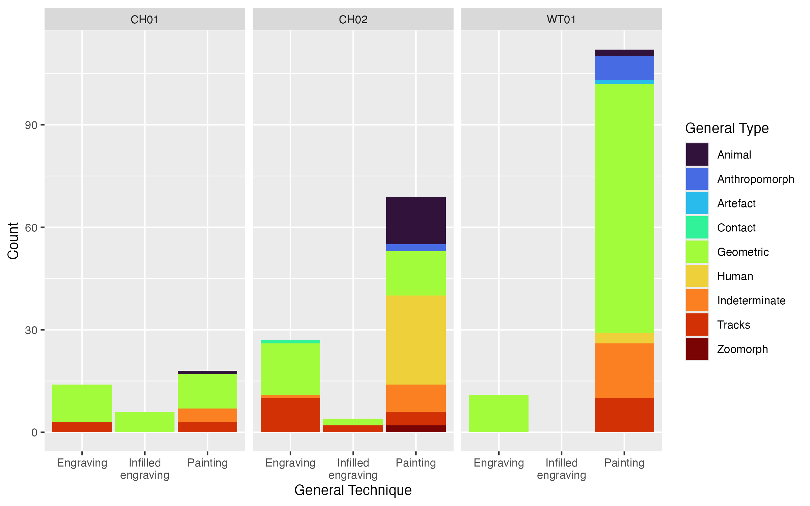
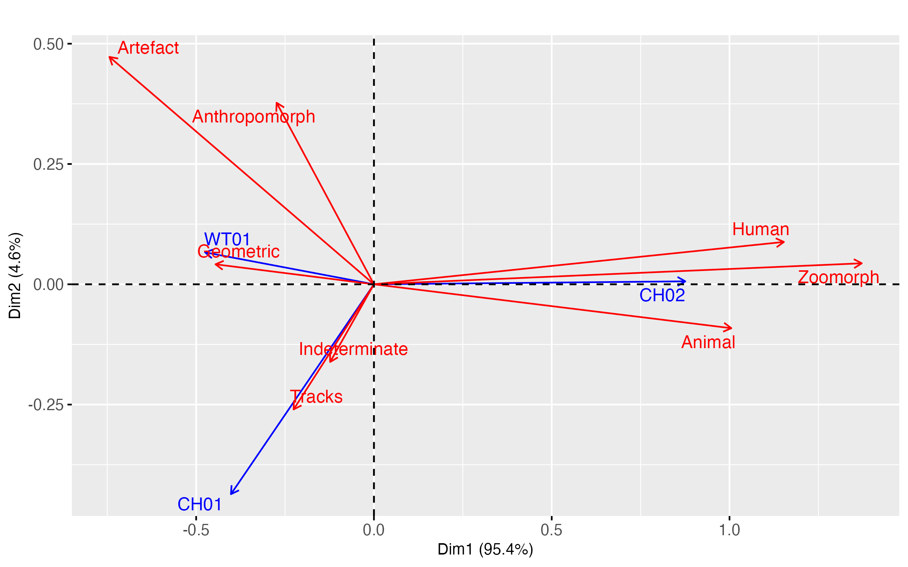

## Rock Art Analysis Package (RAAP), v01: Data, Schema and Scripts for the Formal Analysis of Rock Art Data

> **Author**: Dr Mick Morrison, University of New England.
>
> **Last major update**: 10 Jun 2025

This repository contains data, schema and scripts for analysing rock art motifs identified as part of the Kuuku I'yu Rock Art Project, within the Kaanju Ngaachi Indigenous Protected Area, Cape York Peninsula, Australia. The project was conducted in collaboration with the Chuulangun Aboriginal Corporation.

The goal of this repository is to enable others to reproduce the tables and figures used in our research, or to use our data, schema or scripts in other work. Please acknowledge this. You can cite the RAAP as:

> Morrison, M., Marshall, N., & D. Claudie (2024) Rock Art Analysis Package (RAAP): Data, Schema and Scripts for the Formal Analysis of Rock Art Data \[Data set\]. V.01. <https://doi.org/10.5281/zenodo.12730323>.

The RAAP was developed via the research project presented in a forthcoming journal paper. Details to follow.

## Ethics and Indigenous Cultural and Intellectual Property

This research was approved through the University of New England Human Research Ethics Committee, Approval number HE20_219, as a component of the Australian Research Council-funded *Sugarbag and Shellfish: Indigenous Foodways in Colonial Cape York Peninsula* (LP170100050) project (2019-2024). It formerly had ethics approval at Flinders University before the project and investigator moved to UNE.

This repository *does not* include images of rock art or Indigenous heritage places, as these remain the cultural property of Kuuku I'yu (Northern Kaanju) Custodians and *are restricted*. 

Approved images are available in the published paper or via the [Chuulangun Aboriginal Corporation](https://www.kaanjungaachi.com.au/ChuulangunAboriginalCorporation.htm "Chuulangun Aboriginal Corporation") associated media releases.

## Requirements

This is a basic to intermediate package of tools and you will need:

-   some experience with R;
-   to be comfortable modifying the scripts provided to suit your system and needs;
-   R (version 4.0.0 or later);
-   RStudio (not essential, and another R IDE should be fine)
-   R packages: `data.table`, `dplyr`, `tidyverse`, `officer`, `readxl`, `pivottabler`, `openxlsx`, `basictabler`, `flextable`, `ggplot2`, `FactoMineR`, `factoextra`, `DescTools`, `corrplot`, `ca`, `dummy`, `viridis`, `kableExtra` These are listed in the relevant scripts and are only required if you are trying to run a script from this release. Some can take time to get working correctly, as dependencies will need to be installed either as an R package, or onto your system generally.

## Scripts

### `script01_datacleaning.R`

This script cleans the original dataset created during Marshall's Masters thesis research (2018, Flinders University). It performs various transformations to the data and saves the cleaned data for further analysis as an RDS binary file.

Use this script if you want the cleaned data as a spreadsheet. You'll need to add a line of code to do so at the end of the script, as the intention here is reproducibility via the use of R. The line `write.csv(data, "path")` will likely do it. 

Data outputs (RDS files) are in \`/data\`

### `script02_tables.R`

This script loads the cleaned data produced in script01 and produces the tables summarising datasets in a `*.docx` file. If the script is unmodified from the source, it will generate the published tables and appendices of the published paper in sequence to `/outputs` within your working directory.

### `script03_figures.R`

This script produces a series of figures to accompany the manuscript. It includes statistical analyses such as chi-square tests and correspondence analysis, with results saved as image files to `/outputs`

## Data

> `motifdata2018v03`

The data provided is a modified version produced by co-authors Marshall and Morrison during the desktop analysis of digital models and field images of Kuuku I'yu rock art, as described in the published study. These are uncleaned so are not consistent with published data. Run the scripts to reproduce that dataset.

## Classification Schema

Marshall (2018) produced the following tables of values used to classify identified motifs. These can be used to create a simple database if required. See the published paper or Marshall (2018) for further details.

## Usage 

1.   Clone the RAAP repo to your computer. Cloning or forking from Github is recommended, and for the simplest method use Github Desktop. You can also download the latest release as a Zip.
2.   Create a new project within RStudio, and save to the RAAP directory.
3.   Open all scripts, and modify the path and working directory in the first few lines to suit your system. You'll need the full path. Save
4.   Open Script 1, and run (select all and `run`). Verify that it has worked correctly by checking that your `/data` directory now includes a series of binary files. No warnings or error messages should appear in R Console.
5.   Open Script 2, run and if it runs without error, check the `outputs` directory. It will now include `tables.docx` generated by the script.
6.   Open Script 3, run and if it runs without error, check the `outputs` directory. It will now include three figures generated by the script.

This is just a basic overview, the scripts can be modified to use other data.
